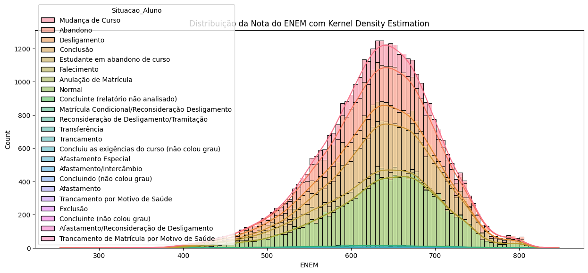
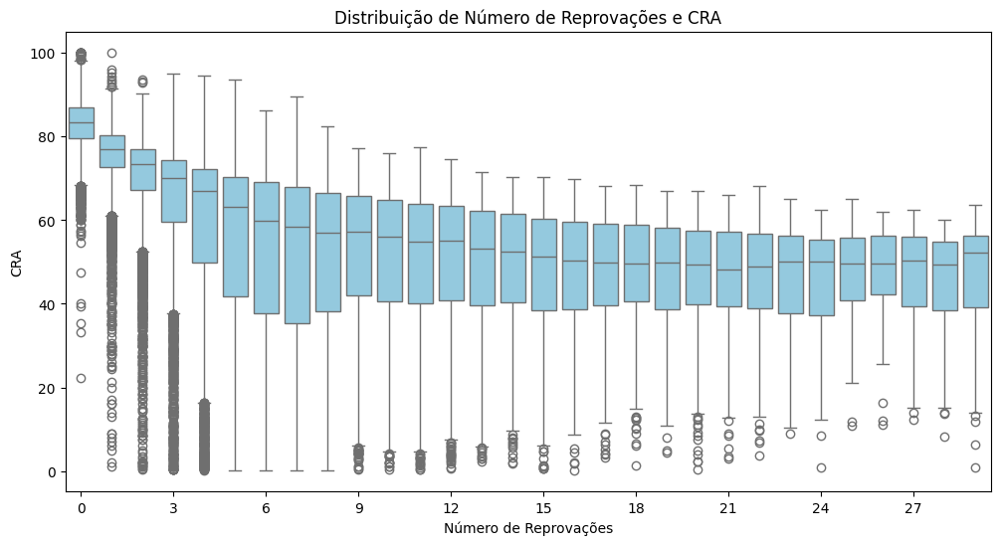
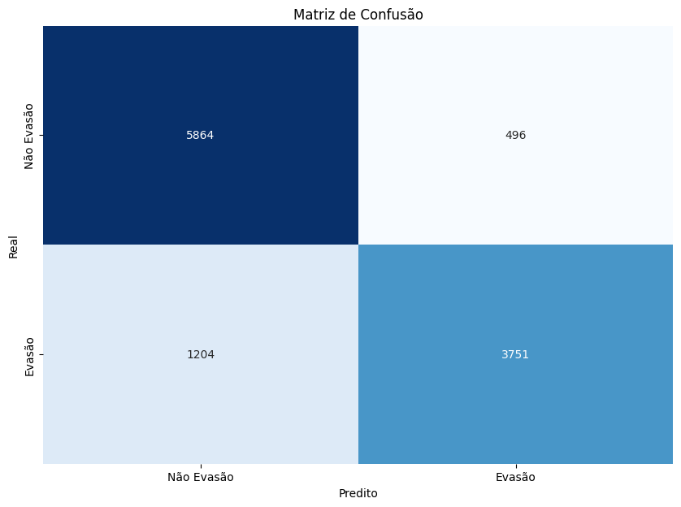

# Análise de Evasão de Estudantes da UFV

## Descrição
Este projeto visa investigar os fatores associados à evasão de estudantes da Universidade Federal de Viçosa (UFV), utilizando dados históricos de desempenho acadêmico, características demográficas e informações de cursos. Foram analisadas questões como a influência da nota do ENEM, reprovações, modalidade de ingresso, idade de admissão e diferenças entre campi. O trabalho inclui análises estatísticas, visualizações e modelos preditivos para identificar padrões e prever riscos de evasão.

## Perguntas Respondidas
O trabalho abordou as seguintes 10 questões:

1. Como a nota do ENEM influencia na evasão dos estudantes?  
2. Quais os períodos que possuem mais abandono?  
3. Quais cursos apresentam as maiores taxas de abandono?  
4. Como varia a taxa de abandono para o mesmo curso em diferentes campus?  
5. Existe uma correlação entre o nível de dificuldade de ingresso em um curso e a taxa de conclusão dos estudantes?  
6. Como a idade de admissão dos alunos impacta a taxa de evasão? Há uma tendência de evasão mais elevada entre os alunos mais jovens ou mais velhos?  
7. Há correlação entre a modalidade de inscrição dos alunos (ampla concorrência, cotas sociais, cotas raciais) e a evasão?  
8. Existe relação entre o número de reprovações e a probabilidade de evasão dos alunos?  
9. Há diferença significativa na evasão entre os sexos? E entre diferentes campus da UFV?  
10. Quais são as principais características daqueles que evadem o curso? E daqueles que concluem?  

## Tecnologias Usadas
- **Linguagem**: Python
- **Bibliotecas**: 
  - Pandas, NumPy
  - Matplotlib, Seaborn
  - Scipy, Statsmodels
  - Scikit-learn (para modelos de classificação e validação cruzada)
- **Ferramentas**: Jupyter Notebook

## Instalação
1. Clone o repositório:
   ```bash
   git clone https://github.com/alvaroagsn/TPs-Ciencia-de-Dados.git
   ```
2. Instale as dependências:
   ```bash
   pip install pandas numpy matplotlib seaborn scipy scikit-learn statsmodels
   ```
3. Execute o Jupyter Notebook:
   ```bash
   jupyter notebook TP.md
   ```

## Uso
O projeto está organizado em um Jupyter Notebook com as seguintes etapas:
1. **Importação de bibliotecas e dados**: Carregamento do dataset `Dados de estudantes da UFV - 2022-12-12.csv`.
2. **Limpeza de dados**: Tratamento de valores nulos, correção de inconsistências e padronização de colunas.
3. **Análise exploratória**: Visualizações como histogramas, boxplots e gráficos de barras para explorar relações entre variáveis.
4. **Resposta às perguntas de pesquisa**: Análises estatísticas (testes t, ANOVA, correlações) para cada questão proposta.
5. **Modelagem preditiva**: Uso de Regressão Logística, KNN, Gradient Boosting e Random Forest para prever evasão, com ajuste de hiperparâmetros e validação cruzada.
6. **Clusterização**: Aplicação de K-Means para agrupar alunos com características similares.

## Resultados Principais

### Insights Chave
1. **Nota do ENEM**: Alunos com notas mais baixas no ENEM têm maior probabilidade de evasão (p-valor < 0.05).
2. **Cursos com maior evasão**: Licenciaturas EAD (Matemática, Física) apresentam taxas de evasão superiores a 85%.
3. **Período de evasão**: Os primeiros semestres concentram o maior número de abandonos.
4. **Reprovações**: Alunos com mais de 5 reprovações têm 59% de chance de evadir.
5. **Idade**: Alunos mais velhos (>25 anos) têm taxas de evasão 48% maiores que os mais jovens.

### Desempenho dos Modelos Preditivos
| Modelo               | Acurácia | Precisão (Evasão) | Recall (Evasão) |
|----------------------|----------|-------------------|-----------------|
| Regressão Logística  | 81.6%    | 84%               | 71%             |
| KNN                  | 82.6%    | 83%               | 76%             |
| **Gradient Boosting**| **85.0%**| **88%**           | **76%**         |
| Random Forest        | 84.7%    | 86%               | 77%             |

### Visualizações Destacadas
1. **Distribuição de notas do ENEM por evasão**:  
   
2. **Relação entre reprovações e CRA**:  
   
3. **Matriz de Confusão (Melhor Modelo)**:  
   

## Licença
Este projeto está licenciado sob a Licença MIT. Consulte o arquivo [LICENSE](LICENSE) para detalhes.